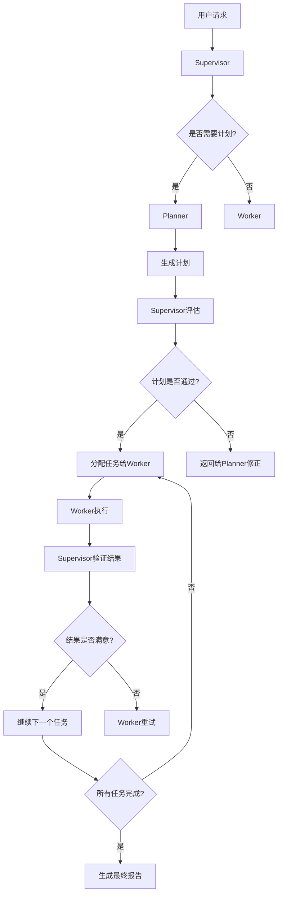
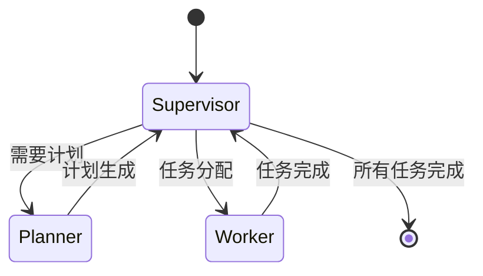

# Ca1pherManus 技术架构文档

## 系统架构概览

Ca1pherManus 采用基于 LangGraph 的多代理协作架构，通过分层设计实现复杂任务的智能处理。

## 核心组件

### 1. 代理层 (Agent Layer)

#### Supervisor 代理
- **职责**: 整体任务协调、计划评估、结果验证
- **核心功能**:
  - 计划评估和修正
  - 任务分配和路由
  - 结果质量验证
  - 重试机制管理

#### Planner 代理
- **职责**: 任务分解和计划制定
- **核心功能**:
  - 用户需求分析
  - 任务分解和规划
  - 工人能力匹配
  - 计划优化

#### Worker 代理
- **职责**: 具体任务执行
- **核心功能**:
  - 任务执行
  - 结果生成
  - 状态报告

### 2. 工作流层 (Workflow Layer)

#### LangGraph 工作流
```python
# 工作流定义
workflow = StateGraph(AgentState)
workflow.add_node("supervisor", supervisor_agent)
workflow.add_node("planner", planner_agent)
workflow.add_node("worker", worker_agent)
```

#### 状态管理
```python
class AgentState(TypedDict):
    messages: List[BaseMessage]
    current_request: Optional[str]
    overall_plan: Optional[Plan]
    active_subtask_id: Optional[str]
    current_agent_role: Optional[str]
    last_agent_role: Optional[str]
    last_worker_result: Optional[str]
    plan_revision_count: int
    task_revision_count: int
```

### 3. 数据层 (Data Layer)

#### 计划结构
```python
class Plan(TypedDict):
    steps: List[SubTask]

class SubTask(TypedDict):
    task_id: str
    task_name: str
    description: str
    worker: Optional[str]
    estimated_time: str
    dependencies: List[str]
    status: Optional[str]
    result: Optional[str]
```

## 工作流程

### 1. 任务处理流程



### 2. 状态转换



## 技术实现细节

### 1. 路由机制

```python
def route_to_agent(state: AgentState) -> str:
    active_task = _find_active_task(state)
    if active_task and active_task.get("status") == "active":
        assignee = active_task.get("worker")
        if assignee:
            return assignee
    
    role = state.get("current_agent_role")
    if role == "planner":
        return "planner"
    elif role == "supervisor":
        return "supervisor"
    elif role == "end_process":
        return END
```

### 2. 错误处理

#### 重试机制
- 计划重试：最多 2 次
- 任务重试：最多 3 次
- 强制接受：超过重试次数后强制通过

#### 异常处理
```python
try:
    # 执行逻辑
    result = chain.invoke(input)
except Exception as e:
    logger.error(f"Error: {e}")
    return {
        "messages": [AIMessage(content=f"Error: {e}")],
        "current_agent_role": "supervisor",
        "overall_plan": {"steps": []}
    }
```

### 3. 流式响应

```python
async def chat_stream(message: str):
    async for chunk in app_graph.astream(
        {"messages": [HumanMessage(content=message)]}
    ):
        yield f"data: {json.dumps(chunk)}\n\n"
```

## 配置管理

### 1. 工人配置

```yaml
workers:
  - name: other_worker
    handler_function: "app.langgraph_core.agents.main.other_worker_agent.other_worker_node"
    tools: []
```

### 2. LLM 配置

```python
# Supervisor LLM
supervisor_llm = ChatOpenAI(
    model="gpt-4o-mini", 
    temperature=0.6
)

# Planner LLM
planner_llm = ChatOpenAI(
    model="gpt-4o-mini", 
    temperature=0.3
)

# Worker LLM
worker_llm = ChatOpenAI(
    model="gpt-4o-mini", 
    temperature=0.7
)
```

## 性能优化

### 1. 并发处理
- 异步 API 处理
- 流式响应
- 非阻塞 I/O

### 2. 内存管理
- 状态清理机制
- 消息历史限制
- 资源释放

### 3. 缓存策略
- 计划缓存
- 工人能力缓存
- 结果缓存

## 监控和日志

### 1. 日志系统
```python
logger = logging.getLogger(__name__)
logger.info("Agent: Planner")
logger.error(f"Error: {e}", exc_info=True)
```

### 2. 状态监控
- 代理状态跟踪
- 任务执行时间
- 错误率统计

### 3. 性能指标
- 响应时间
- 吞吐量
- 资源使用率

## 安全考虑

### 1. 输入验证
- 消息长度限制
- 内容过滤
- 格式验证

### 2. 权限控制
- API 访问控制
- 资源限制
- 用户隔离

### 3. 数据保护
- 敏感信息过滤
- 日志脱敏
- 数据加密

## 扩展性设计

### 1. 模块化架构
- 代理独立开发
- 工具插件化
- 配置外部化

### 2. 水平扩展
- 无状态设计
- 负载均衡
- 分布式部署

### 3. 功能扩展
- 新工人类型
- 自定义工具
- 第三方集成

## 部署架构

### 开发环境
```
┌─────────────────┐
│   Frontend      │
│   (Vite/React)  │
└─────────────────┘
         │
┌─────────────────┐
│   FastAPI       │
│   (Uvicorn)     │
└─────────────────┘
         │
┌─────────────────┐
│   LangGraph     │
│   Workflow      │
└─────────────────┘
         │
┌─────────────────┐
│   OpenAI API    │
└─────────────────┘
```

### 生产环境
```
┌─────────────────┐
│   Load Balancer │
└─────────────────┘
         │
┌─────────────────┐
│   FastAPI       │
│   (Multiple)    │
└─────────────────┘
         │
┌─────────────────┐
│   Redis Cache   │
└─────────────────┘
         │
┌─────────────────┐
│   Database      │
└─────────────────┘
```

## 故障排除

### 常见问题

1. **JSON 解析错误**
   - 检查提示词模板中的大括号转义
   - 验证 LLM 响应格式

2. **路由错误**
   - 检查工人配置
   - 验证状态转换逻辑

3. **性能问题**
   - 监控 LLM 调用频率
   - 检查缓存命中率

### 调试工具

1. **日志分析**
   ```bash
   tail -f logs/app.log
   ```

2. **状态检查**
   ```python
   print(state.get("current_agent_role"))
   print(state.get("overall_plan"))
   ```

3. **性能监控**
   ```python
   import time
   start_time = time.time()
   # 执行操作
   print(f"耗时: {time.time() - start_time}")
   ```

## 最佳实践

### 1. 代码组织
- 单一职责原则
- 依赖注入
- 接口分离

### 2. 错误处理
- 优雅降级
- 详细日志
- 用户友好提示

### 3. 性能优化
- 异步处理
- 资源复用
- 缓存策略

### 4. 安全防护
- 输入验证
- 权限控制
- 数据保护 